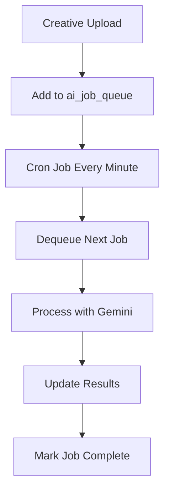

# Brand Onboarding Implementation

## Overview

This document details the implementation of the brand onboarding feature, the core user flow for setting up brand guidelines in QAlien. The onboarding system integrates with Google Gemini for advanced creative compliance analysis and includes an AI job queue system for efficient processing.

### Completed Features

*   **Step 1: Visual Identity (COMPLETE)**: Manages brand colors and logos with deletion capability.
*   **Step 2: Verbal Identity (COMPLETE)**: Configures brand tone and vocabulary.
*   **Step 3: Golden Set Creatives (COMPLETE)**: Uploads creative examples with video thumbnail support.
*   **Step 4: Campaign Details (COMPLETE)**: Sets up campaign information.
*   **Step 5: Review & Submit (COMPLETE)**: Final review and submission.
*   **Step 6: Multi-step Wizard UI (UI ONLY)**: The UI for the wizard is implemented, but the logic for navigation and state management is not fully integrated.
*   **Step 7: Submission & Processing (REVIEW)**: The submission process is implemented, but the backend processing and ML hooks are under review.
*   **Step 8: Brand Settings Management (COMPLETE)**: Full CRUD operations for all brand settings including visual identity, guidelines, golden set, and danger zone.

## Complete Implementation Details

### Database Schema Evolution

**`brands` table:**

*   Added: `website TEXT`
*   Added: `phonetic_pronunciation TEXT` - for pronunciation compliance checking
*   Added: `required_disclaimers TEXT[]` - for disclaimer compliance
*   Existing: `logo_files[]`, `color_palette[]`, `tone_keywords[]`, `approved_terms[]`, `banned_terms[]`

**`golden_set_creatives` table (NEW):**

*   `id`: `uuid`, primary key
*   `brand_id`: `uuid`, foreign key to `brands`
*   `storage_path`: `text`
*   `file_name`: `text`
*   `file_type`: `text`
*   `creative_type`: `text` (`'UGC'` | `'Produced'`)
*   `status`: `text`, default `'pending'`

**`ai_job_queue` table (NEW):**

*   `id`: `uuid`, primary key
*   `asset_id`: `uuid`, foreign key to `campaign_assets`
*   `status`: `text` (`'pending'` | `'processing'` | `'completed'` | `'failed'`)
*   `created_at`: `timestamp`
*   `started_at`: `timestamp`
*   `completed_at`: `timestamp`
*   `error_message`: `text`

**`team_invitations` table (NEW):**

*   `id`: `uuid`, primary key
*   `email`: `text`
*   `role`: `text`
*   `scope_type`: `text` (`'organization'` | `'brand'`)
*   `scope_id`: `text`
*   `invited_by`: `text`
*   `status`: `text`
*   `expires_at`: `timestamp`

### Storage Structure

**`brand-assets/` (public bucket)**

*   `guidelines/{brand_id}/brand-guidelines-{timestamp}.pdf`
*   `logos/{brand_id}/logos/{timestamp}-{filename}.{ext}`
*   `golden-set/{brand_id}/{timestamp}-{filename}.{ext}`

**Important:** All storage paths must be stored as full URLs in the database to avoid relative path issues:
```
https://[project-ref].supabase.co/storage/v1/object/public/brand-assets/[path]
```

## AI Processing Pipeline

### Google Gemini Integration

The system uses Google Gemini 1.5 Pro for comprehensive creative analysis:

```typescript
// Video analysis with Gemini
const geminiResults = await analyzeCreativeWithGemini(videoUrl, brand)

// Compliance checks performed:
// - Logo compliance
// - Color compliance 
// - Brand tone analysis
// - Disclaimer compliance
// - Layout compliance
// - UGC classification
```

### AI Job Queue System

To handle multiple uploads without overwhelming the AI services, QAlien implements a robust queue system:



**Key Features:**
- Atomic job dequeuing with locking
- Retry logic with exponential backoff
- Comprehensive error handling
- Real-time status updates

### Video Codec Compatibility

The system includes sophisticated video format detection:

```typescript
// Detect iPhone HEVC videos that need conversion
const compatibility = isLikelyCompatible(mimeType, fileSize, fileName)
if (!compatibility.compatible) {
  // Provide conversion recommendations
}
```

**Supported Formats:**
- MP4 (H.264/AVC) ✅
- WebM ✅
- MOV (H.264) ✅
- HEVC/H.265 ❌ (conversion recommended)

## Critical Implementation Patterns

### Clerk JWT Integration

We use the `accessToken` option to integrate Clerk with Supabase, which is more secure and reliable than custom fetch implementations.

```typescript
// DON'T use custom fetch - use accessToken option
createClient(url, key, {
  accessToken: async () => await getToken({ template: 'supabase' })
})
```

### Anonymous Supabase Client for Storage

We use an anonymous Supabase client for storage uploads to avoid "invalid UUID" errors that can occur when using an authenticated client.

```typescript
// Use anonymous client to avoid "invalid UUID" errors
await supabaseAnon.storage.from('brand-assets').upload(...)
```

### Parallel Uploads

We use `Promise.all` to upload multiple files in parallel, which significantly improves performance.

### Client-Side Video Thumbnail Generation

For video previews in the Golden Set, we use the native HTML5 video element's ability to display thumbnails:

```typescript
// Simple video preview component
<video
  src={videoUrl}
  preload="metadata"
  onLoadedMetadata={(e) => {
    e.currentTarget.currentTime = 1; // Seek to 1 second for better preview
  }}
/>
```

This approach avoids CORS issues that can occur with canvas-based thumbnail generation.

## Testing Instructions

### Step 1: Visual Identity

1.  Navigate to the brand onboarding wizard.
2.  Enter a brand name and website.
3.  Upload a logo.
4.  Verify that the logo is uploaded to the `brand-assets/logos` directory in Supabase storage.
5.  Verify that the `brands` table in Supabase is updated with the correct information.

### Step 2: Verbal Identity

1.  Enter brand tone keywords (used by Gemini for tone compliance analysis).
2.  Enter approved and banned terms.
3.  Enter phonetic pronunciation for brand name (optional).
4.  Enter required disclaimers.
5.  Verify that the `brands` table in Supabase is updated with the correct information including `tone_keywords`, `approved_terms`, `banned_terms`, `phonetic_pronunciation`, and `required_disclaimers`.

### Step 3: Golden Set Creatives

1.  Upload a creative example (image or video).
2.  Select the creative type (UGC or Produced).
3.  Verify that the creative is uploaded to the `brand-assets/golden-set` directory in Supabase storage.
4.  Verify that a new record is created in the `golden_set_creatives` table in Supabase.
5.  For videos, verify that they display with proper thumbnails and play on hover.

### Step 4: Campaign Details

1.  Enter campaign details.
2.  Verify that the `brands` table in Supabase is updated with the correct information.

### Step 5: Review & Submit

1.  Review all the information entered in the previous steps.
2.  Click "Submit".
3.  Verify that the `brands` and `golden_set_creatives` tables in Supabase are updated correctly.

### Step 6: Brand Settings Management

1.  Navigate to a brand's settings page via the gear icon.
2.  Test editing each section (Company Info, Guidelines, Visual Identity, Verbal Identity, Golden Set).
3.  Test logo deletion in Visual Identity - mark logos for deletion and save.
4.  Test Guidelines PDF download - verify it downloads to machine instead of opening in new tab.
5.  Test video playback in Golden Set - verify videos show thumbnails and play on hover.
6.  Test brand deletion in Danger Zone - requires typing "DELETE" to confirm.
