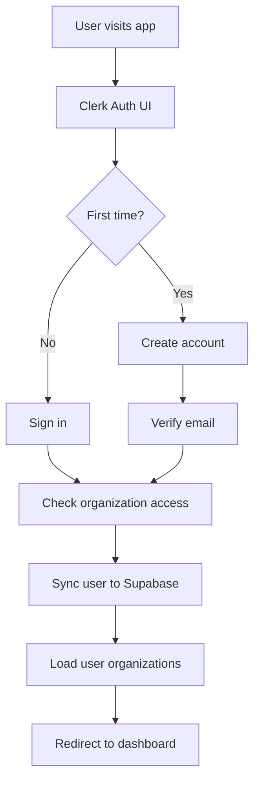
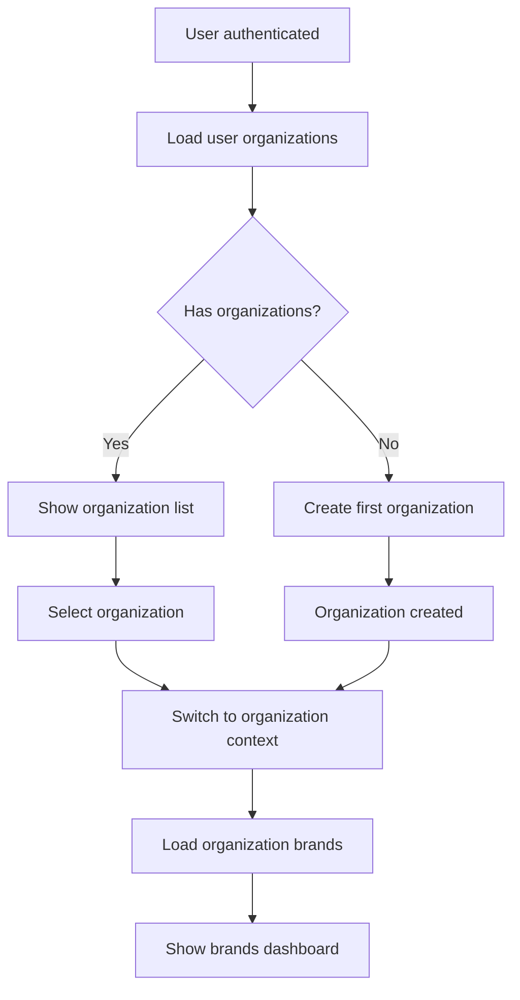
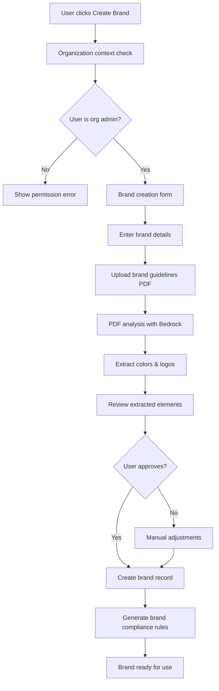
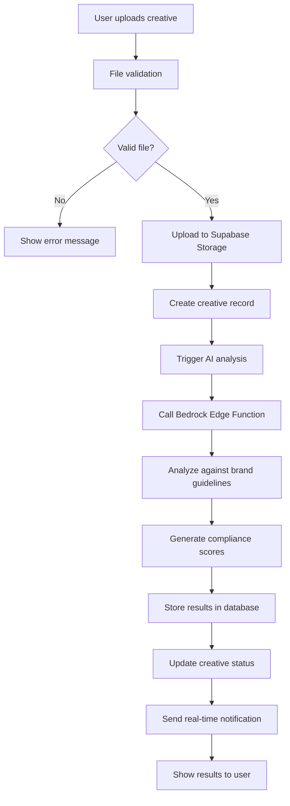
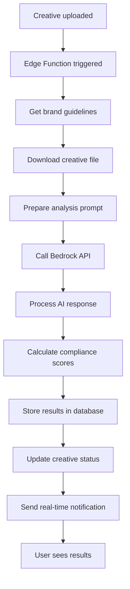
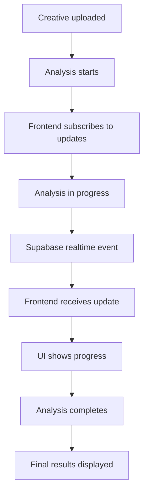
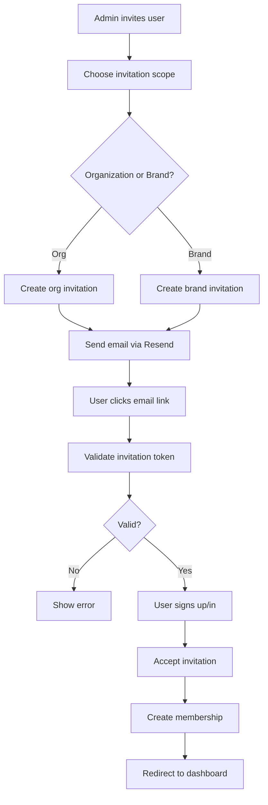
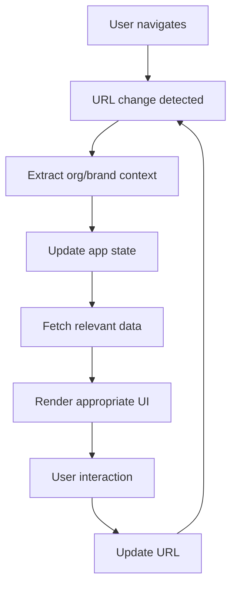

# User Flows - Modern Stack
> **Status**: Migration to Modern Stack Architecture  
> **Last Updated**: 7 Jan 2025  
> **Stack**: Vercel + Supabase + Clerk + Bedrock

---

## 🚀 **Modern Stack User Flows**

### **Core Architecture**
- **Frontend**: Next.js 15 + React 19 + Vercel
- **Auth**: Clerk (multi-tenant organizations)
- **Database**: Supabase Postgres + Row Level Security
- **API**: Supabase Edge Functions
- **AI**: AWS Bedrock via Edge Functions
- **Storage**: Supabase Storage (S3-compatible)

---

## 🔐 **Authentication Flow**

### **1. User Registration/Login**


### **Implementation**
```typescript
// app/sign-in/[[...sign-in]]/page.tsx
import { SignIn } from '@clerk/nextjs'

export default function SignInPage() {
  return (
    <div className="flex min-h-screen items-center justify-center">
      <SignIn 
        appearance={{
          elements: {
            card: 'shadow-lg',
            headerTitle: 'text-2xl font-bold',
            footerAction: 'text-sm'
          }
        }}
        afterSignInUrl="/"
        afterSignUpUrl="/onboarding"
      />
    </div>
  )
}
```

---

## 🏢 **Organization Management Flow**

### **2. Organization Selection/Creation**


### **Implementation**
```typescript
// components/OrganizationSelector.tsx
import { useOrganizations } from '@clerk/nextjs'
import { useRouter } from 'next/navigation'

export function OrganizationSelector() {
  const { organizationList, isLoaded } = useOrganizations()
  const router = useRouter()
  
  const handleSelectOrg = async (orgId: string) => {
    await clerk.organizations.setActive({ organization: orgId })
    router.push(`/?org=${orgId}`)
  }
  
  if (!isLoaded) return <div>Loading organizations...</div>
  
  if (!organizationList.length) {
    return (
      <div className="text-center py-8">
        <h2 className="text-xl font-semibold mb-4">Welcome to QAlien</h2>
        <p className="text-gray-600 mb-4">Create your first organization to get started</p>
        <CreateOrganizationButton />
      </div>
    )
  }
  
  return (
    <div className="grid grid-cols-1 md:grid-cols-2 lg:grid-cols-3 gap-4">
      {organizationList.map(org => (
        <div 
          key={org.id}
          onClick={() => handleSelectOrg(org.id)}
          className="border rounded-lg p-4 hover:shadow-md cursor-pointer"
        >
          <h3 className="font-semibold">{org.name}</h3>
          <p className="text-sm text-gray-600">{org.membersCount} members</p>
        </div>
      ))}
    </div>
  )
}
```

---

## 🎨 **Brand Onboarding Flow**

### **3. Brand Creation Process**


### **Implementation**
```typescript
// components/BrandOnboardingWizard.tsx
import { useState } from 'react'
import { useRouter } from 'next/navigation'
import { useSupabaseClient } from '@/lib/supabase'

export function BrandOnboardingWizard() {
  const [step, setStep] = useState(1)
  const [brandData, setBrandData] = useState({
    name: '',
    description: '',
    industry: '',
    guidelines_pdf: null
  })
  const [isProcessing, setIsProcessing] = useState(false)
  const supabase = useSupabaseClient()
  const router = useRouter()
  
  const handleSubmit = async () => {
    setIsProcessing(true)
    
    try {
      // 1. Create brand record
      const { data: brand } = await supabase
        .from('brands')
        .insert({
          name: brandData.name,
          description: brandData.description,
          industry: brandData.industry,
          org_id: currentOrgId
        })
        .select()
        .single()
      
      // 2. Upload guidelines PDF
      if (brandData.guidelines_pdf) {
        await uploadGuidelines(brand.id, brandData.guidelines_pdf)
      }
      
      // 3. Trigger AI analysis
      await triggerPDFAnalysis(brand.id)
      
      router.push(`/brands/${brand.id}`)
    } catch (error) {
      console.error('Brand creation failed:', error)
    } finally {
      setIsProcessing(false)
    }
  }
  
  return (
    <div className="max-w-2xl mx-auto">
      <div className="mb-8">
        <div className="flex items-center">
          {[1, 2, 3, 4].map(i => (
            <div 
              key={i}
              className={`w-8 h-8 rounded-full flex items-center justify-center ${
                i <= step ? 'bg-blue-500 text-white' : 'bg-gray-300'
              }`}
            >
              {i}
            </div>
          ))}
        </div>
      </div>
      
      {step === 1 && (
        <BrandDetailsStep 
          data={brandData}
          onChange={setBrandData}
          onNext={() => setStep(2)}
        />
      )}
      
      {step === 2 && (
        <GuidelinesUploadStep
          data={brandData}
          onChange={setBrandData}
          onNext={() => setStep(3)}
          onBack={() => setStep(1)}
        />
      )}
      
      {step === 3 && (
        <ReviewStep
          data={brandData}
          onSubmit={handleSubmit}
          onBack={() => setStep(2)}
          isProcessing={isProcessing}
        />
      )}
      
      {step === 4 && (
        <CompletionStep />
      )}
    </div>
  )
}
```

---

## 🎭 **Creative Analysis Flow**

### **4. Creative Upload & Analysis**


### **Implementation**
```typescript
// components/CreativeUploader.tsx
import { useSupabaseClient } from '@/lib/supabase'
import { useDropzone } from 'react-dropzone'

export function CreativeUploader({ brandId }: { brandId: string }) {
  const supabase = useSupabaseClient()
  const [uploading, setUploading] = useState(false)
  
  const onDrop = useCallback(async (acceptedFiles: File[]) => {
    setUploading(true)
    
    for (const file of acceptedFiles) {
      try {
        // 1. Upload file to Supabase Storage
        const fileExt = file.name.split('.').pop()
        const fileName = `${Date.now()}.${fileExt}`
        const filePath = `creatives/${brandId}/${fileName}`
        
        const { data: uploadData, error: uploadError } = await supabase.storage
          .from('qalien-assets')
          .upload(filePath, file)
        
        if (uploadError) throw uploadError
        
        // 2. Create creative record
        const { data: creative } = await supabase
          .from('creatives')
          .insert({
            brand_id: brandId,
            filename: file.name,
            file_url: uploadData.path,
            file_size: file.size,
            mime_type: file.type,
            status: 'processing'
          })
          .select()
          .single()
        
        // 3. Trigger AI analysis
        await triggerAnalysis(creative.id)
        
        toast.success(`${file.name} uploaded successfully`)
      } catch (error) {
        console.error('Upload failed:', error)
        toast.error(`Failed to upload ${file.name}`)
      }
    }
    
    setUploading(false)
  }, [brandId, supabase])
  
  const { getRootProps, getInputProps, isDragActive } = useDropzone({
    onDrop,
    accept: {
      'image/*': ['.png', '.jpg', '.jpeg', '.gif'],
      'video/*': ['.mp4', '.mov', '.avi']
    },
    maxSize: 100 * 1024 * 1024 // 100MB
  })
  
  return (
    <div 
      {...getRootProps()}
      className={`border-2 border-dashed rounded-lg p-8 text-center cursor-pointer
        ${isDragActive ? 'border-blue-500 bg-blue-50' : 'border-gray-300'}
        ${uploading ? 'opacity-50 cursor-not-allowed' : ''}
      `}
    >
      <input {...getInputProps()} />
      
      {uploading ? (
        <div>
          <div className="animate-spin rounded-full h-8 w-8 border-b-2 border-blue-500 mx-auto"></div>
          <p className="mt-2">Uploading...</p>
        </div>
      ) : (
        <div>
          <div className="text-4xl mb-4">📁</div>
          <p className="text-lg font-medium">
            {isDragActive ? 'Drop files here' : 'Drag & drop files here'}
          </p>
          <p className="text-gray-600 mt-2">or click to select files</p>
          <p className="text-sm text-gray-500 mt-2">
            Supports images and videos up to 100MB
          </p>
        </div>
      )}
    </div>
  )
}
```

---

## 📊 **AI Analysis Processing**

### **5. Bedrock Analysis Flow**


### **Edge Function Implementation**
```typescript
// supabase/functions/ai-analysis/index.ts
import { createClient } from '@supabase/supabase-js'
import { BedrockRuntime } from '@aws-sdk/client-bedrock-runtime'

export default async function handler(req: Request) {
  const { creative_id } = await req.json()
  
  const supabase = createClient(
    Deno.env.get('SUPABASE_URL')!,
    Deno.env.get('SUPABASE_SERVICE_ROLE_KEY')!
  )
  
  const bedrock = new BedrockRuntime({
    region: 'us-east-1',
    credentials: {
      accessKeyId: Deno.env.get('AWS_ACCESS_KEY_ID')!,
      secretAccessKey: Deno.env.get('AWS_SECRET_ACCESS_KEY')!
    }
  })
  
  try {
    // 1. Get creative and brand data
    const { data: creative } = await supabase
      .from('creatives')
      .select(`
        *,
        brands (
          name,
          color_palette,
          tone_keywords,
          approved_terms,
          banned_terms,
          required_disclaimers
        )
      `)
      .eq('id', creative_id)
      .single()
    
    // 2. Get file from storage
    const { data: fileData } = await supabase.storage
      .from('qalien-assets')
      .download(creative.file_url)
    
    // 3. Analyze with Bedrock
    const analysisResult = await analyzeCreative(bedrock, creative, fileData)
    
    // 4. Store results
    await supabase
      .from('creative_analysis')
      .insert({
        creative_id: creative.id,
        brand_id: creative.brand_id,
        tag_results: analysisResult.tag_results,
        overall_status: analysisResult.overall_status,
        confidence_score: analysisResult.confidence,
        ai_model_version: 'claude-3-5-sonnet-20241022-v2:0'
      })
    
    // 5. Update creative status
    await supabase
      .from('creatives')
      .update({
        status: 'completed',
        analysis_results: analysisResult.tag_results,
        overall_status: analysisResult.overall_status
      })
      .eq('id', creative.id)
    
    return new Response(JSON.stringify({ success: true }))
  } catch (error) {
    console.error('Analysis failed:', error)
    
    // Update creative with error status
    await supabase
      .from('creatives')
      .update({ status: 'failed' })
      .eq('id', creative_id)
    
    return new Response(
      JSON.stringify({ error: error.message }),
      { status: 500 }
    )
  }
}
```

---

## 📱 **Real-time Updates Flow**

### **6. Live Status Updates**


### **Implementation**
```typescript
// hooks/useRealtimeAnalysis.ts
import { useEffect, useState } from 'react'
import { useSupabaseClient } from '@/lib/supabase'

export function useRealtimeAnalysis(creativeId: string) {
  const [analysis, setAnalysis] = useState(null)
  const [status, setStatus] = useState('pending')
  const supabase = useSupabaseClient()
  
  useEffect(() => {
    // Subscribe to real-time updates
    const subscription = supabase
      .channel('creative_analysis')
      .on(
        'postgres_changes',
        {
          event: 'UPDATE',
          schema: 'public',
          table: 'creatives',
          filter: `id=eq.${creativeId}`
        },
        (payload) => {
          setStatus(payload.new.status)
          setAnalysis(payload.new.analysis_results)
        }
      )
      .subscribe()
    
    return () => {
      subscription.unsubscribe()
    }
  }, [creativeId, supabase])
  
  return { analysis, status }
}
```

---

## 🔄 **Team Collaboration Flow**

### **7. Team Invitation Process**


### **Implementation**
```typescript
// components/InviteTeamMember.tsx
import { useState } from 'react'
import { useSupabaseClient } from '@/lib/supabase'

export function InviteTeamMember({ brandId }: { brandId: string }) {
  const [email, setEmail] = useState('')
  const [role, setRole] = useState<'admin' | 'editor' | 'viewer'>('viewer')
  const [scope, setScope] = useState<'brand' | 'organization'>('brand')
  const [isLoading, setIsLoading] = useState(false)
  const supabase = useSupabaseClient()
  
  const handleInvite = async (e: React.FormEvent) => {
    e.preventDefault()
    setIsLoading(true)
    
    try {
      // Call Edge Function to handle invitation
      const { data, error } = await supabase.functions.invoke('invite-user', {
        body: {
          email,
          role,
          scope,
          brand_id: brandId
        }
      })
      
      if (error) throw error
      
      toast.success(`Invitation sent to ${email}`)
      setEmail('')
    } catch (error) {
      console.error('Invitation failed:', error)
      toast.error('Failed to send invitation')
    } finally {
      setIsLoading(false)
    }
  }
  
  return (
    <form onSubmit={handleInvite} className="space-y-4">
      <div>
        <label className="block text-sm font-medium mb-2">
          Email Address
        </label>
        <input
          type="email"
          value={email}
          onChange={(e) => setEmail(e.target.value)}
          className="w-full border rounded-md px-3 py-2"
          required
        />
      </div>
      
      <div>
        <label className="block text-sm font-medium mb-2">
          Role
        </label>
        <select
          value={role}
          onChange={(e) => setRole(e.target.value as any)}
          className="w-full border rounded-md px-3 py-2"
        >
          <option value="viewer">Viewer</option>
          <option value="editor">Editor</option>
          <option value="admin">Admin</option>
        </select>
      </div>
      
      <div>
        <label className="block text-sm font-medium mb-2">
          Access Scope
        </label>
        <select
          value={scope}
          onChange={(e) => setScope(e.target.value as any)}
          className="w-full border rounded-md px-3 py-2"
        >
          <option value="brand">This brand only</option>
          <option value="organization">All organization brands</option>
        </select>
      </div>
      
      <button
        type="submit"
        disabled={isLoading}
        className="w-full bg-blue-500 text-white rounded-md py-2 px-4 hover:bg-blue-600 disabled:opacity-50"
      >
        {isLoading ? 'Sending...' : 'Send Invitation'}
      </button>
    </form>
  )
}
```

---

## 🎯 **Navigation & State Management**

### **8. URL-Driven Navigation Flow**


### **Implementation**
```typescript
// components/AppRouter.tsx
import { useRouter, useSearchParams } from 'next/navigation'
import { useEffect } from 'react'

export function AppRouter() {
  const router = useRouter()
  const searchParams = useSearchParams()
  const orgId = searchParams.get('org')
  const brandId = searchParams.get('brand')
  
  // Organization context
  const { data: organizations } = useOrganizations()
  const currentOrg = organizations?.find(o => o.id === orgId)
  
  // Brand context
  const { data: brands } = useBrands(orgId)
  const currentBrand = brands?.find(b => b.id === brandId)
  
  // Navigate to appropriate view
  useEffect(() => {
    if (!orgId && organizations?.length) {
      // No org selected, show org selector
      router.push('/')
    } else if (orgId && !currentOrg) {
      // Invalid org, redirect to org selector
      router.push('/')
    } else if (orgId && brandId && !currentBrand) {
      // Invalid brand, redirect to brand list
      router.push(`/?org=${orgId}`)
    }
  }, [orgId, brandId, organizations, currentOrg, currentBrand, router])
  
  // Render appropriate component based on URL state
  if (!orgId) {
    return <OrganizationSelector />
  }
  
  if (!brandId) {
    return <BrandDashboard orgId={orgId} />
  }
  
  return <BrandDetail brandId={brandId} />
}
```

---

This comprehensive user flow documentation provides clear implementation guidance for QAlien's migration to the modern stack while maintaining all existing functionality and improving the user experience.