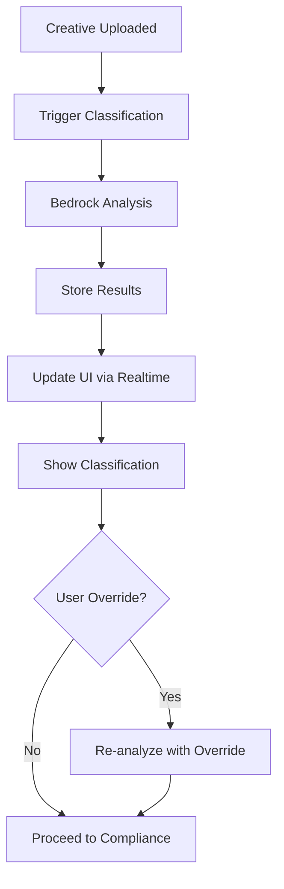

# UGC Classification - Modern Stack
> **Status**: Modern Stack Implementation with Bedrock AI  
> **Last Updated**: 7 Jan 2025  
> **Purpose**: AI-powered UGC classification using Bedrock multimodal models

---

## 🚀 **Modern UGC Classification System**

### **Architecture Overview**
- **AI Model**: AWS Bedrock Claude 3.5 Sonnet (multimodal)
- **Processing**: Supabase Edge Functions
- **Database**: PostgreSQL with JSONB classification results
- **Real-time**: Supabase Realtime for status updates
- **Override**: Instant re-analysis with cached results

### **Key Improvements**
1. **AI-Powered**: Advanced multimodal analysis vs heuristics
2. **Faster**: Edge Functions vs Lambda cold starts
3. **Smarter**: Visual + audio + text analysis combined
4. **Real-time**: Instant UI updates during processing
5. **Maintainable**: No complex heuristic rules

---

## 🤖 **Bedrock AI Classification**

### **Modern Classification Pipeline**
```typescript
// Edge Function: UGC Classification
import { BedrockRuntime } from '@aws-sdk/client-bedrock-runtime'

export default async function handler(req: Request) {
  const { creativeId, fileUrl, mimeType } = await req.json()
  
  const bedrock = new BedrockRuntime({
    region: 'us-east-1',
    credentials: {
      accessKeyId: Deno.env.get('AWS_ACCESS_KEY_ID')!,
      secretAccessKey: Deno.env.get('AWS_SECRET_ACCESS_KEY')!
    }
  })
  
  // Analyze with Bedrock multimodal
  const classification = await classifyWithBedrock(
    bedrock, 
    fileUrl, 
    mimeType
  )
  
  // Store results in Supabase
  const supabase = createClient(
    Deno.env.get('SUPABASE_URL')!,
    Deno.env.get('SUPABASE_SERVICE_ROLE_KEY')!
  )
  
  await supabase
    .from('creatives')
    .update({
      creative_type: classification.type,
      ugc_score: classification.confidence,
      ugc_analysis: classification.analysis,
      classification_timestamp: new Date().toISOString()
    })
    .eq('id', creativeId)
  
  return Response.json(classification)
}

async function classifyWithBedrock(
  bedrock: BedrockRuntime,
  fileUrl: string,
  mimeType: string
) {
  const response = await bedrock.invokeModel({
    modelId: 'anthropic.claude-3-5-sonnet-20241022-v2:0',
    body: JSON.stringify({
      messages: [
        {
          role: 'user',
          content: [
            {
              type: 'text',
              text: `Analyze this creative and classify it as either "UGC" (User-Generated Content) or "Produced" (Professional Content).

              Consider these factors:
              - Visual quality and production value
              - Audio quality and editing
              - Aspect ratio and framing
              - Lighting and composition
              - Text overlays and graphics
              - Overall professional polish

              Provide a confidence score (0-100) and detailed analysis.
              
              Return JSON in this format:
              {
                "type": "UGC" | "Produced",
                "confidence": number,
                "analysis": {
                  "visual_quality": { "score": number, "notes": string },
                  "audio_quality": { "score": number, "notes": string },
                  "composition": { "score": number, "notes": string },
                  "overall_reasoning": string
                }
              }`
            },
            {
              type: 'image',
              source: {
                type: 'base64',
                media_type: mimeType,
                data: await getBase64FromUrl(fileUrl)
              }
            }
          ]
        }
      ],
      max_tokens: 1000
    })
  })
  
  const result = JSON.parse(new TextDecoder().decode(response.body))
  return JSON.parse(result.content[0].text)
}
```

---

## 🎯 **Advanced Classification Logic**

### **Multimodal Analysis Factors**
```typescript
interface ClassificationAnalysis {
  visual_quality: {
    score: number        // 0-100 professional score
    notes: string        // Analysis details
    factors: {
      lighting: number   // Professional lighting quality
      composition: number // Rule of thirds, framing
      stability: number  // Camera shake, movement
      resolution: number // Image/video quality
    }
  }
  audio_quality: {
    score: number        // 0-100 professional score
    notes: string        // Analysis details
    factors: {
      clarity: number    // Audio clarity
      background_noise: number // Noise levels
      mixing: number     // Audio mixing quality
      music: number      // Background music quality
    }
  }
  production_elements: {
    score: number        // 0-100 professional score
    notes: string        // Analysis details
    factors: {
      graphics: number   // Professional graphics/text
      transitions: number // Edit transitions
      branding: number   // Brand elements
      effects: number    // Professional effects
    }
  }
  overall_reasoning: string // AI explanation
}
```

### **Classification Decision Logic**
```typescript
function determineClassification(analysis: ClassificationAnalysis) {
  // Weighted scoring
  const weights = {
    visual: 0.4,
    audio: 0.3,
    production: 0.3
  }
  
  const overallScore = 
    analysis.visual_quality.score * weights.visual +
    analysis.audio_quality.score * weights.audio +
    analysis.production_elements.score * weights.production
  
  // Classification thresholds
  const isUGC = overallScore < 60
  const confidence = Math.abs(overallScore - 50) * 2 // 0-100 confidence
  
  return {
    type: isUGC ? 'UGC' : 'Produced',
    confidence: Math.min(confidence, 100),
    score: overallScore
  }
}
```

---

## 🗃️ **Database Schema**

### **Enhanced Creative Table**
```sql
-- Add UGC classification fields
ALTER TABLE creatives ADD COLUMN IF NOT EXISTS
  creative_type VARCHAR(20) DEFAULT 'UGC' CHECK (creative_type IN ('UGC', 'Produced'));

ALTER TABLE creatives ADD COLUMN IF NOT EXISTS
  ugc_score INTEGER DEFAULT 0 CHECK (ugc_score >= 0 AND ugc_score <= 100);

ALTER TABLE creatives ADD COLUMN IF NOT EXISTS
  ugc_analysis JSONB DEFAULT '{}';

ALTER TABLE creatives ADD COLUMN IF NOT EXISTS
  creative_type_override VARCHAR(20) CHECK (creative_type_override IN ('UGC', 'Produced'));

ALTER TABLE creatives ADD COLUMN IF NOT EXISTS
  classification_timestamp TIMESTAMP;

-- Index for efficient queries
CREATE INDEX idx_creatives_type ON creatives(creative_type);
CREATE INDEX idx_creatives_ugc_score ON creatives(ugc_score);
```

### **Classification Results Structure**
```json
{
  "creative_id": "creative-uuid-123",
  "creative_type": "UGC",
  "ugc_score": 75,
  "creative_type_override": null,
  "ugc_analysis": {
    "visual_quality": {
      "score": 45,
      "notes": "Handheld camera with natural lighting, typical of UGC",
      "factors": {
        "lighting": 40,
        "composition": 35,
        "stability": 30,
        "resolution": 70
      }
    },
    "audio_quality": {
      "score": 55,
      "notes": "Clear speech but ambient noise present",
      "factors": {
        "clarity": 70,
        "background_noise": 40,
        "mixing": 50,
        "music": 60
      }
    },
    "production_elements": {
      "score": 25,
      "notes": "Minimal post-production, authentic UGC style",
      "factors": {
        "graphics": 10,
        "transitions": 20,
        "branding": 30,
        "effects": 40
      }
    },
    "overall_reasoning": "This appears to be authentic user-generated content based on the handheld camera work, natural lighting, and minimal post-production elements. The audio quality is good but has typical UGC characteristics like ambient noise."
  },
  "classification_timestamp": "2025-01-07T10:30:00Z"
}
```

---

## 🔄 **Real-time Processing Flow**

### **Classification Workflow**


### **Real-time UI Updates**
```typescript
// React component with real-time updates
function CreativeClassification({ creativeId }: { creativeId: string }) {
  const [classification, setClassification] = useState<any>(null)
  const [isProcessing, setIsProcessing] = useState(true)
  const supabase = useSupabaseClient()
  
  useEffect(() => {
    // Subscribe to real-time updates
    const subscription = supabase
      .channel('creative_classification')
      .on(
        'postgres_changes',
        {
          event: 'UPDATE',
          schema: 'public',
          table: 'creatives',
          filter: `id=eq.${creativeId}`
        },
        (payload) => {
          setClassification(payload.new)
          setIsProcessing(false)
        }
      )
      .subscribe()
    
    return () => subscription.unsubscribe()
  }, [creativeId])
  
  if (isProcessing) {
    return (
      <div className="flex items-center gap-2">
        <div className="animate-spin rounded-full h-4 w-4 border-b-2 border-blue-500"></div>
        <span>Analyzing content type...</span>
      </div>
    )
  }
  
  return (
    <div className="space-y-4">
      <div className="flex items-center gap-2">
        <span className="font-medium">Content Type:</span>
        <ClassificationBadge type={classification.creative_type} />
        <span className="text-sm text-gray-600">
          {classification.ugc_score}% confidence
        </span>
      </div>
      
      <ClassificationOverride 
        creativeId={creativeId}
        currentType={classification.creative_type}
        onOverride={handleOverride}
      />
      
      <ClassificationAnalysis analysis={classification.ugc_analysis} />
    </div>
  )
}
```

---

## 🎛️ **User Override System**

### **Override Interface**
```typescript
function ClassificationOverride({ 
  creativeId, 
  currentType, 
  onOverride 
}: {
  creativeId: string
  currentType: 'UGC' | 'Produced'
  onOverride: (newType: string) => void
}) {
  const [isOverriding, setIsOverriding] = useState(false)
  const supabase = useSupabaseClient()
  
  const handleOverride = async (newType: 'UGC' | 'Produced') => {
    setIsOverriding(true)
    
    try {
      // Update with override
      await supabase
        .from('creatives')
        .update({ 
          creative_type_override: newType,
          creative_type: newType  // Update effective type
        })
        .eq('id', creativeId)
      
      // Trigger re-analysis
      await supabase.functions.invoke('reclassify-creative', {
        body: { creativeId, overrideType: newType }
      })
      
      onOverride(newType)
    } catch (error) {
      console.error('Override failed:', error)
    } finally {
      setIsOverriding(false)
    }
  }
  
  return (
    <div className="flex items-center gap-2">
      <span className="text-sm text-gray-600">Not right?</span>
      <select
        value={currentType}
        onChange={(e) => handleOverride(e.target.value as any)}
        disabled={isOverriding}
        className="border rounded px-2 py-1"
      >
        <option value="UGC">User-Generated Content</option>
        <option value="Produced">Professional Content</option>
      </select>
      {isOverriding && (
        <div className="animate-spin rounded-full h-4 w-4 border-b-2 border-blue-500"></div>
      )}
    </div>
  )
}
```

### **Override Processing**
```typescript
// Edge Function: Re-classification
export default async function handler(req: Request) {
  const { creativeId, overrideType } = await req.json()
  
  const supabase = createClient(
    Deno.env.get('SUPABASE_URL')!,
    Deno.env.get('SUPABASE_SERVICE_ROLE_KEY')!
  )
  
  // Update override
  await supabase
    .from('creatives')
    .update({
      creative_type_override: overrideType,
      creative_type: overrideType,
      override_timestamp: new Date().toISOString()
    })
    .eq('id', creativeId)
  
  // Trigger compliance re-analysis with new type
  await supabase.functions.invoke('analyze-compliance', {
    body: { 
      creativeId, 
      forceReanalyze: true,
      classificationOverride: overrideType
    }
  })
  
  return Response.json({ success: true })
}
```

---

## 🎯 **Compliance Rule Integration**

### **Type-Aware Compliance Analysis**
```typescript
// Compliance analysis with classification context
async function analyzeCompliance(
  creativeId: string,
  brandGuidelines: BrandGuidelines,
  classificationType: 'UGC' | 'Produced'
) {
  const bedrock = new BedrockRuntime(bedrockConfig)
  
  // Adjust prompt based on classification
  const promptContext = classificationType === 'UGC' 
    ? `This is USER-GENERATED CONTENT. Apply tone and layout rules with more flexibility while maintaining strict legal and vocabulary compliance.`
    : `This is PROFESSIONAL CONTENT. Apply all compliance rules with full strictness across all categories.`
  
  const response = await bedrock.invokeModel({
    modelId: 'anthropic.claude-3-5-sonnet-20241022-v2:0',
    body: JSON.stringify({
      messages: [
        {
          role: 'user',
          content: `${promptContext}
          
          Brand Guidelines: ${JSON.stringify(brandGuidelines)}
          Creative: ${creativeUrl}
          
          Analyze for compliance using the 7-tag system with appropriate strictness level.`
        }
      ]
    })
  })
  
  return parseComplianceResults(response)
}
```

### **Strictness Levels**
```typescript
interface ComplianceStrictness {
  UGC: {
    brand_tone: 'lenient'        // Allow casual language
    layout_safe_zone: 'relaxed'  // Flexible positioning
    disclaimers: 'strict'        // No compromise
    vocabulary: 'strict'         // Maintain standards
  }
  Produced: {
    brand_tone: 'strict'         // Professional standards
    layout_safe_zone: 'strict'   // Exact positioning
    disclaimers: 'strict'        // No compromise
    vocabulary: 'strict'         // Maintain standards
  }
}
```

---

## 📊 **Analytics & Monitoring**

### **Classification Metrics**
```typescript
// Analytics dashboard queries
const classificationMetrics = await supabase
  .from('creatives')
  .select(`
    creative_type,
    ugc_score,
    creative_type_override,
    created_at
  `)
  .eq('brand_id', brandId)
  .gte('created_at', startDate)
  .lte('created_at', endDate)

// Calculate accuracy metrics
const accuracy = calculateClassificationAccuracy(classificationMetrics)
```

### **Performance Tracking**
```sql
-- Classification performance query
SELECT 
  creative_type,
  COUNT(*) as total_creatives,
  AVG(ugc_score) as avg_confidence,
  COUNT(*) FILTER (WHERE creative_type_override IS NOT NULL) as overrides,
  COUNT(*) FILTER (WHERE creative_type_override IS NOT NULL) * 100.0 / COUNT(*) as override_rate
FROM creatives
WHERE brand_id = $1 
  AND created_at >= $2
GROUP BY creative_type;
```

---

## 🔍 **Validation & Testing**

### **Classification Validation**
```typescript
// Test classification accuracy
async function validateClassification() {
  const testCases = [
    { url: 'ugc-example-1.mp4', expectedType: 'UGC' },
    { url: 'produced-example-1.mp4', expectedType: 'Produced' }
  ]
  
  for (const testCase of testCases) {
    const result = await classifyCreative(testCase.url)
    const accuracy = result.type === testCase.expectedType ? 100 : 0
    
    console.log(`Test: ${testCase.url}`)
    console.log(`Expected: ${testCase.expectedType}, Got: ${result.type}`)
    console.log(`Accuracy: ${accuracy}%`)
  }
}
```

### **A/B Testing Framework**
```typescript
// A/B test different classification approaches
async function abTestClassification(creativeId: string) {
  const approaches = ['bedrock_v1', 'bedrock_v2', 'hybrid']
  const results = {}
  
  for (const approach of approaches) {
    results[approach] = await classifyWithApproach(creativeId, approach)
  }
  
  // Compare results and confidence scores
  return analyzeApproachPerformance(results)
}
```

---

## 🚀 **Future Enhancements**

### **Advanced AI Features**
1. **Fine-tuned Models**: Brand-specific classification models
2. **Contextual Analysis**: Consider brand history and preferences
3. **Batch Processing**: Classify multiple creatives simultaneously
4. **Confidence Calibration**: Improve confidence score accuracy
5. **Multi-language Support**: Classification in multiple languages

### **User Experience Improvements**
1. **Explanation Interface**: Show why classification was made
2. **Learning System**: Improve from user corrections
3. **Bulk Override**: Change multiple classifications at once
4. **Classification History**: Track changes over time
5. **Confidence Thresholds**: User-defined confidence levels

### **Performance Optimizations**
1. **Edge Caching**: Cache classification results
2. **Parallel Processing**: Classify and analyze simultaneously
3. **Smart Batching**: Group similar content types
4. **Predictive Classification**: Pre-classify based on upload patterns

---

This modern UGC classification system provides significantly more accurate and nuanced content type detection while maintaining the flexibility and user control needed for effective brand compliance management.